# [Boiler](https://tryhackme.com/room/boilerctf2)
Start a port scan to discover open ports using Nmap.
```bash
sudo nmap -Pn -T4 <target>
```
**Result**

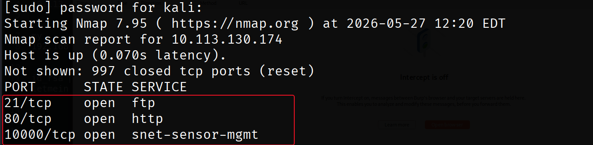

Discover service versions using Nmap.
```bash
sudo nmap -Pn -T4 -sV -sC -p10000,80,21
```

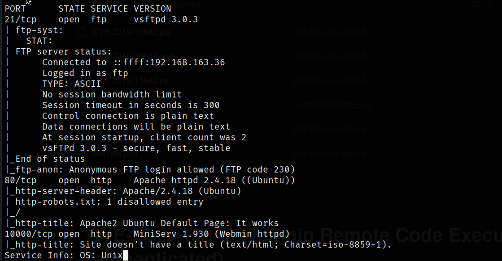

Discovering whether default FTP credentials are valid.
```bash
ftp $IP
# user : ftp
```
It worked. Now we will list all files using `ls -a`.

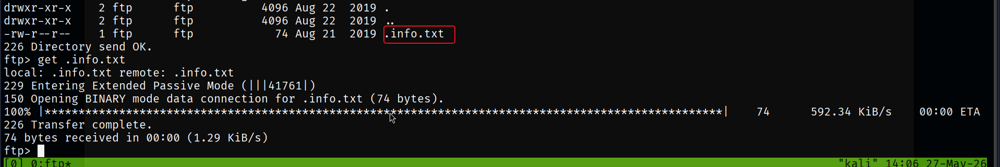

Download the hidden file called `info.txt`.

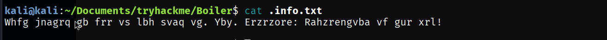

Found this weird text; it seems like it is encrypted with ROT13. After decrypting it, I found this message:
```
Just wanted to see if you find it. Lol. Remember: Enumeration is the key!
```
Continuing with enumeration, I will do directory fuzzing on the HTTP server listening on port 80.
```bash
gobuster dir -w <wordList> -u <target> -t 64
```
**Result**

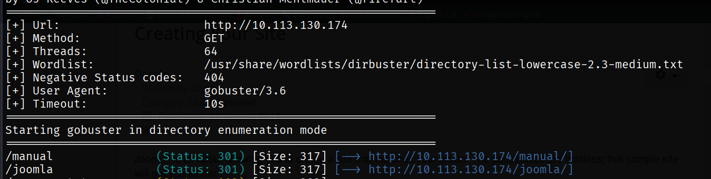

Do directory enumeration for `Joomla`.

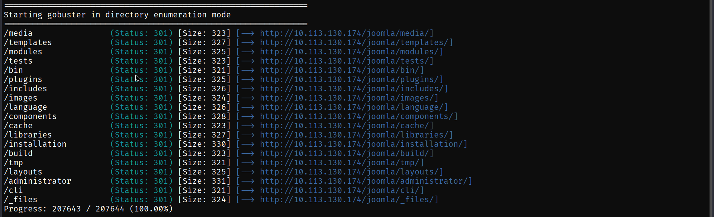

I found this encoded text inside `joomla/_files`.

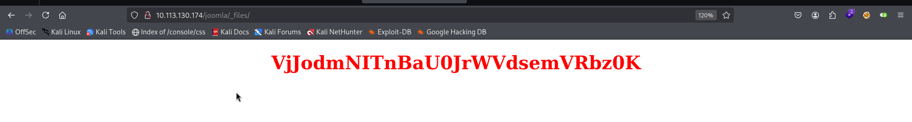

Decoded the message:
```
"Whopsie daisy"
```
XD, I will continue with enumeration. Found a service called *sar2html* which has an [RCE vulnerability](https://www.exploit-db.com/exploits/47204) that we can abuse to get a reverse shell.

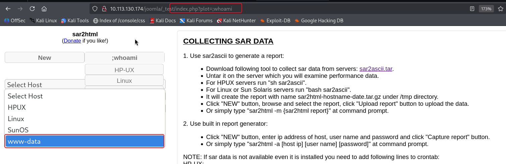

Using this vulnerability for simple enumeration, I used the `ls` command and it showed a file called `log.txt`. This log file has SSH credentials I can use to gain access to the target machine.

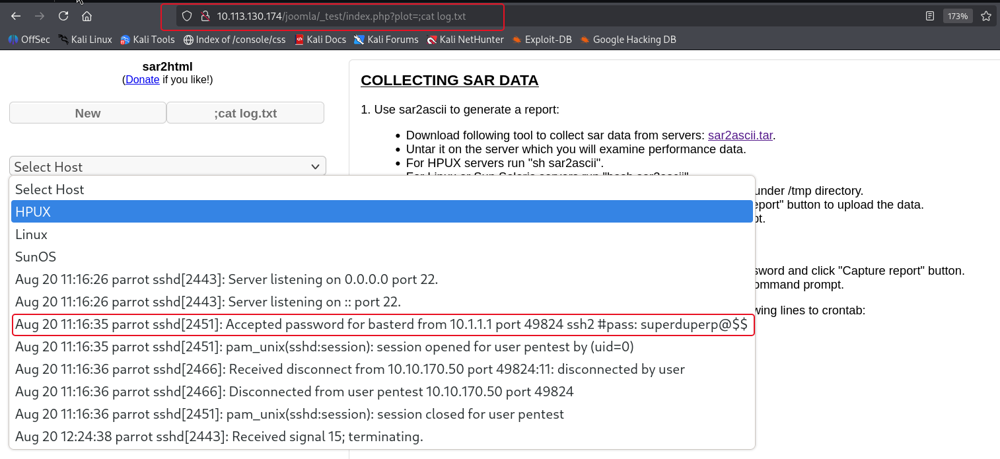

## Initial Access

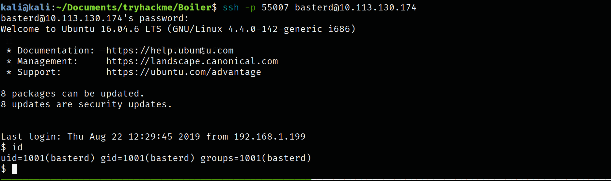

## Enumeration Again
Once I got in, I listed the files in my current directory and found a `backup.sh` file. Inside this file, I found credentials for another user on the target machine called Stoner.

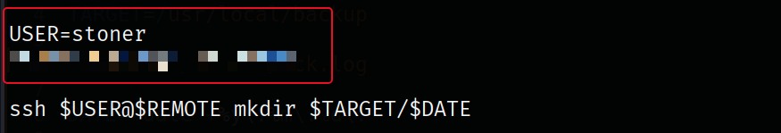

Using SSH to get access.

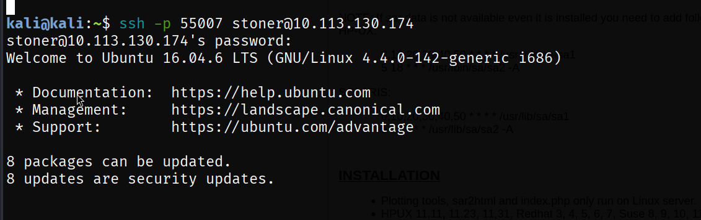

## User Flag

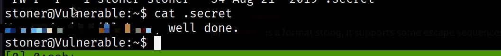

Using *LinPEAS* for enumeration, I found this binary with SUID.

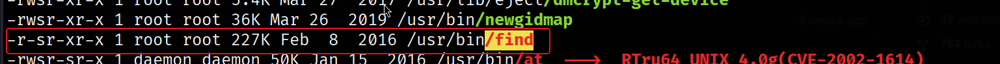

Using the payload from [GTFObin](https://gtfobins.org/):
```bash
find . -exec /bin/sh -p \; -quit
```

## Privilege Escalation

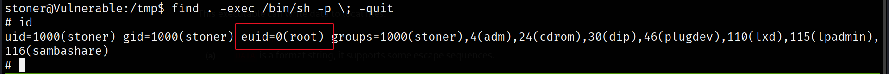

## Root Flag

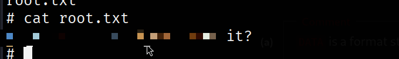
